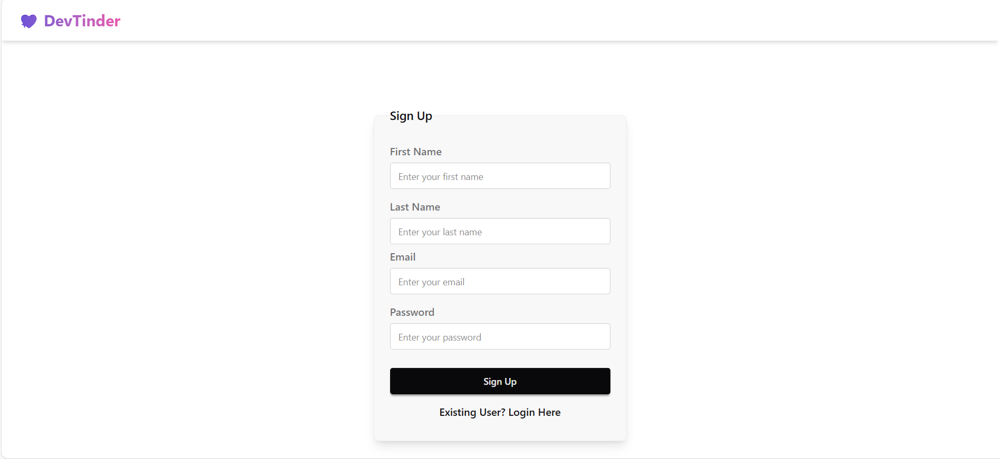
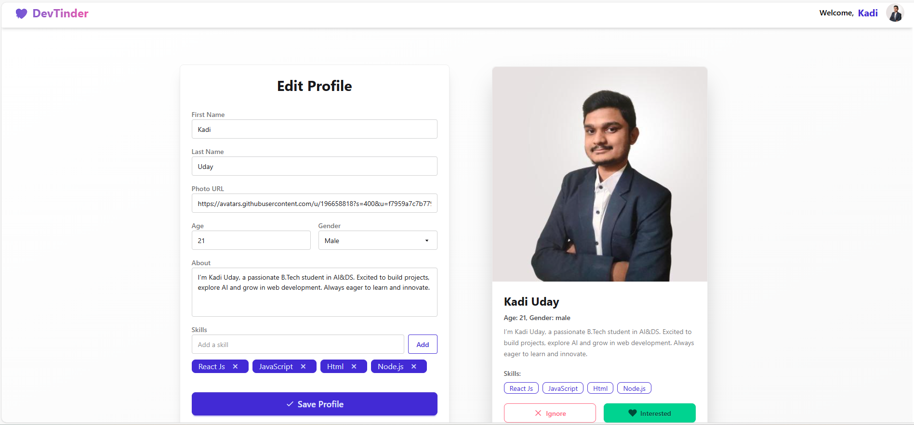
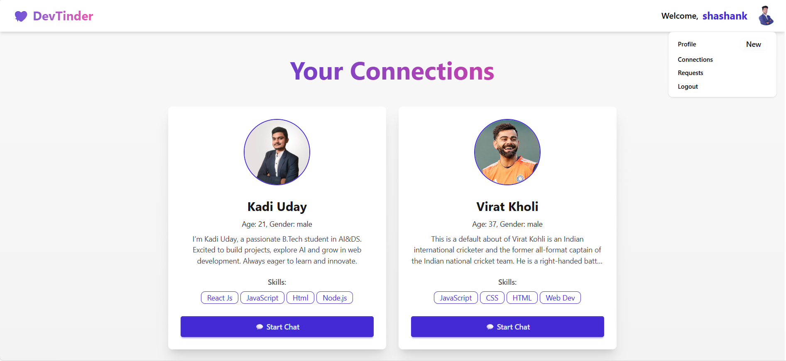

# DevTinder – Frontend

## 🚀 Introduction

DevTinder Frontend is the client-side application for **DevTinder**, a developer-focused networking platform inspired by Tinder. It provides a modern, responsive user interface that allows developers to discover profiles, send connection requests, and interact seamlessly.

The frontend is built using React and Tailwind CSS, following modern UI and state management practices, and integrates with backend APIs to deliver a complete user experience.

---

## ✨ Features

- User signup and login interface
- Browse and view developer profiles
- Send and manage connection requests
- Responsive design for mobile and desktop
- Clean and modern UI using Tailwind CSS
- Global state management with Redux Toolkit
- Seamless integration with backend APIs

---

## 🛠️ Tech Stack

- **Framework:** React.js
- **Build Tool:** Vite
- **Styling:** Tailwind CSS
- **State Management:** Redux Toolkit
- **API Communication:** Fetch / Axios
- **Authentication:** JWT (handled via backend)

---

## 📘 Learnings

Through building the DevTinder frontend, I gained practical experience in:

- Building reusable and scalable UI components using React
- Managing global application state with Redux Toolkit
- Integrating frontend applications with RESTful backend APIs
- Handling authentication flows in frontend applications
- Creating responsive layouts using Tailwind CSS
- Working with environment variables in Vite-based projects

---

## 📸 Screenshots

Below are some screenshots showcasing the DevTinder frontend UI and features:


### 🔐 Login / Signup Page


### 🏠 Home / Feed Page


### 👤 Developer Profile View


### 📱 Connections Page


> Note: Screenshots are added for demonstration and UI overview purposes.

---

## ⚙️ Installation

Follow the steps below to run the project locally:

### 1. Clone the repository:

```bash
git clone https://github.com/kadi-uday/devTinder-FrontEnd.git
cd devTinder-FrontEnd
```

### 2. Install dependencies:

```bash
npm install
```

### 3. Run the development server:

```bash
npm run start
```
---

## 🌐 Live Demo

The DevTinder frontend is live and accessible using the backend deployed on AWS EC2.

🔗 **Live URL:**  
http://13.62.58.3/

> Note: The application is currently accessed using an IP address instead of a custom domain.

## 🤝 **Contributing**

Contributions are welcome! If you find any issues or have suggestions for improvements, please feel free to open an issue or submit a pull request.